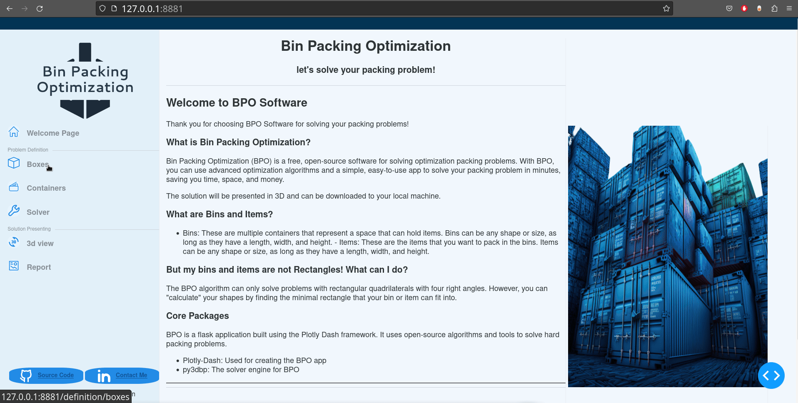

<h1 align="center"><b>Bin Packing Optimization</b></h1>




<a href="https://www.linkedin.com/in/asafbm/"></a>
<a href="https://hub.docker.com/repository/docker/asafbm/bpo/general"></a>    

**To run BPO now:**      
```Bash
docker run --name bpo_app -d -p 8080:8050 asafbm/bpo:latest
```
---


### What is BPO?
  **Bin Packing Optimization** (BPO) is a free and open-source application solving 3D bin packing problems. 
  The Application Framework based on 'Dash-Plotly Multi page' structure and is very modular and can be easily customized and fit any specific problem, requirements and limitations.


### How does BPO Application work?
  By inputting the dimensions and quantities of the boxes you want to pack and the containers where the packages will be stored, 
  you can obtain a solution to the problem in a 3D graph. The app provides a KPI dashboard with an analysis of the solution.      
  BPO does not collect any data  and can be run offline.   
___

### HOW2's:
* [How 2 run the app](app_manual/How_to_run_the_app.md)
* [How 2 use Docker for Dash Apps](app_manual/Docker+Dash.md)

### More-Info:
* [Application Structure](app_manual/Application_Structure.md) 
* [Boxes and Containers](app_manual/Boxes_&_Containers.md)

___